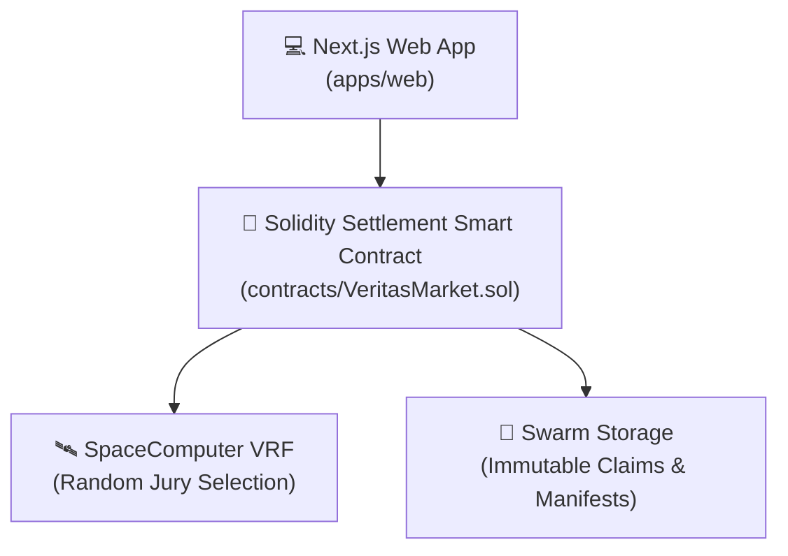

# ⚖️ VeritasMarket

> **Decentralized Random-Jury Belief Settlement & Prediction Protocol**

VeritasMarket is a decentralized prediction and belief-resolution protocol. Participants stake on immutable binary claims (YES/NO), submit cryptographic commit-reveal votes, and a SpaceComputer VRF-selected jury resolves the market with automated stake slashing for dishonest voters.

---

## 🏗️ Monorepo Architecture

### Key Workspaces:
- [`contracts/`](./contracts): Smart contracts for commit-reveal, jury selection, and stake slashing.
- [`apps/web/`](./apps/web): Next.js app with Tailwind glassmorphism UI.
- [`packages/swarm-verified-fetch/`](./packages/swarm-verified-fetch): SDK for verified Swarm CAC/BMT and SOC feed reads.

---

## ⚡ Key Features

1. **Random-Jury VRF Selection**: SpaceComputer randomness selects a subset of staked participants as jury resolvers.
2. **Cryptographic Commit-Reveal**: Protects voter privacy and prevents front-running during resolution.
3. **Automated 20% Stake Slash**: Malicious or non-revealing jurors forfeit stake to honest voters.
4. **Immutable Swarm Storage**: Market specs and metadata are stored verifiably on Swarm.

---

## 📖 Handwritten Learning Notes

Learn how commit-reveal schemes, VRF jury selection, and stake slashing work under the hood:
Read [`LEARNING.md`](file:///Volumes/D%20Drive/All%20Code/Blockchian-Proejcts/VeritasMarket/LEARNING.md)

---

## 📜 License
MIT License. Built for Web3 Hackathons.
